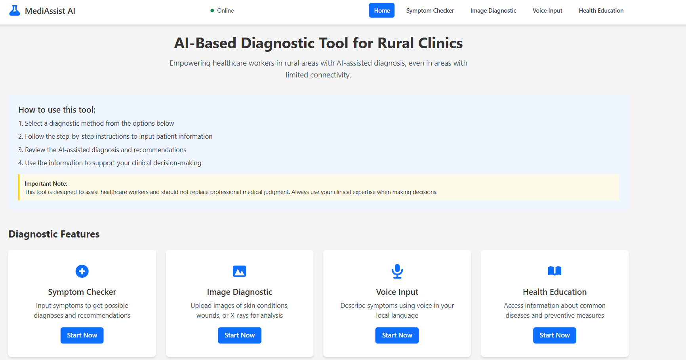

## 🧠 Project: MediAssistAI &nbsp;&nbsp;&nbsp; [🌐 Live Website ](https://diseaseteller.netlify.app/)

---

## 🚀 Inspiration

In rural India, access to quality healthcare is often hindered by limited infrastructure, lack of medical professionals, and low literacy. **MediAssistAI** is built with the mission to bridge this gap using the power of Artificial Intelligence.

By combining **voice-enabled symptom input**, **image-based diagnosis**, and a comprehensive **symptom checker**, SehatAI empowers users—especially from rural and underserved areas—to understand their health conditions better. In addition, it provides **educational resources** and information on **government health schemes** to spread awareness and encourage healthcare engagement.

> *MediAssistAI is your intelligent village health assistant—reliable, accessible, and inclusive.*

---

## 🧾 What It Does

**MediAssistAI** is a rural-friendly AI-based diagnostic tool that allows users to:

- ✅ Check symptoms by selecting **age**, **gender**, **severity**, and specific **symptoms**
- ✅ Upload **medical images** (e.g., X-rays) for ML-powered disease analysis
- ✅ Use **voice input** to describe symptoms in natural language
- ✅ Explore **government healthcare schemes** tailored to their needs
- ✅ Gain health awareness through educational resources

🎯 **Accuracy:** Our ML models achieve up to **90% accuracy** in symptom-based and image-based disease prediction, delivering reliable insights to aid early detection.

This tool provides a **smart**, **multimodal**, and **inclusive** health assistant experience.

---

## 🛠️ Tech Stack

### 🔹 Frontend:
- React.js  
- Tailwind CSS  
- JavaScript  
- Axios  

### 🔹 Backend & AI:
- Flask (Python)  
- Machine Learning Models  
- Speech Recognition (for voice input)  
- Image Classification (for medical images)

### 🔐 Security & Integration:
- RESTful APIs  
- CORS  
- JSON-based communication  

### 🔧 Tools & Deployment:
- Git & GitHub  
- Postman  
- Render / Railway (for backend)  
- Netlify / Vercel (for frontend)

---

## 🏗️ How We Built It

### 🌐 Frontend:
The UI is built using **React** with **Tailwind CSS** for styling. It’s designed to be lightweight and mobile-friendly for rural areas with limited internet connectivity. Users can input symptoms via text or voice and navigate the app easily.

### 🧠 Backend:
The Flask backend handles requests for:
- Symptom-to-disease prediction using trained ML models.
- Image upload and classification.
- Voice-to-text conversion for symptom input.
- Fetching government scheme data.

The ML models are trained on datasets for diseases like pneumonia, tuberculosis, and common viral infections. The system provides an accuracy of **~90%**, ensuring reliability in its predictions.

---

## 🏆 Accomplishments We're Proud Of

- ✅ Developed a multi-input health diagnostic tool (text, image, voice)
- ✅ Achieved ~90% accuracy in diagnosis
- ✅ Optimized for rural areas: minimal data usage, simple UI
- ✅ Integrated government health scheme data dynamically
- ✅ Created awareness tools to empower users with health education

---

## 📸 Screenshots

### 🏠 Home Page


### 🤒 Symptom Checker STEP 1


### 🤒 Symptom Checker STEP 2


### 🤒 Symptom Checker STEP 3


### 🖼️ Image Diagnosis


### 🎤 Voice Input


### 🏥 Government Schemes


## ⚙️ Installation

Follow these steps to run **MediAssistAI** locally:

### 1. Clone Repository

```bash
git clone https://github.com/shwetaverma14/aixplain.git
cd aixplain
```

### 2. Open in VS Code

```bash
code .
```

### 3. Install dependencies for backend

```bash
cd backend
python -m venv venv
source venv/bin/activate  
pip install -r requirements.txt
python app.py

```

### 4. Install dependencies for frontend

```bash
cd client
npm install
npm run dev

```


---

## 📢 Future Scope

- 🌐 **Local language support:**  
  Add multilingual support including **Hindi** and **regional dialects** to improve accessibility for rural users.

- 📱 **Android app version:**  
  Develop an offline-first **mobile application** for areas with limited internet connectivity.

- 📊 **Health trend analytics:**  
  Enable NGOs and healthcare professionals to view **anonymous health trends**, supporting better policy planning.

- 🤖 **Conversational AI Integration:**  
  Integrate **ChatGPT** or similar LLMs for a **chat-based medical assistant** experience, making interactions more intuitive.

---

## 🙌 Contributors

### 👩‍💻 Shweta Verma  
**B.Tech CSE | Full Stack Developer**  
🔗 [GitHub Profile](https://github.com/shwetaverma14)
### 👩‍💻 Sudhanshu Tiwari
**B.Tech CSE | Full Stack Developer**  
🔗 [GitHub Profile](https://github.com/Sudhanshutiwari-cs)

---
🙌 Thanks for checking out **MediAssistAI**!

